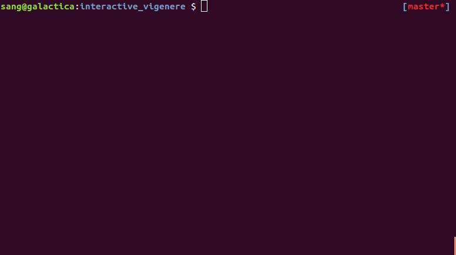

# Interactive Vigenère Cipher

A [Vigenère cipher](https://en.wikipedia.org/wiki/Vigen%C3%A8re_cipher) implementation where you can make changes to plaintext/ciphertext interactively, displaying the result in your terminal.

Runs on Python 3. Written using the curses library. No additional libraries should need to be installed.

## Usage

	$ usage: ./vigenere.py -e|-d text|file.txt -k key_string|-l key_length

**-e | -d**: Set cipher mode to _encryption_ or _decryption_.

**text | file.txt**: Filename with message to cipher. If this file cannot be opened, this argument is interpreted as the message itself.

**-k key_string | -l key_length**: Use either a _key_string_ to cipher the message or enter interactive mode with a key of length _key_length_.

## Keyboard shortcuts

**ESCAPE** -- Exit interactive mode.

**LEFT**/**RIGHT** -- Move cursor over text.

**SPACE** -- Switch between the key and the message.

**[A, B, C, ...]** -- You can enter whatever text you like to change either the key or message. When you change the key, the message is ciphered accordingly; when you change the message, the key is changed to cipher to that character.

## Examples

	$ ./vigenere.py -d 'tiulvxlsfimgccqlvhnenkmgw' -k 'secret'

	$ ./vigenere.py -e 'plaintext.txt' -l 9
